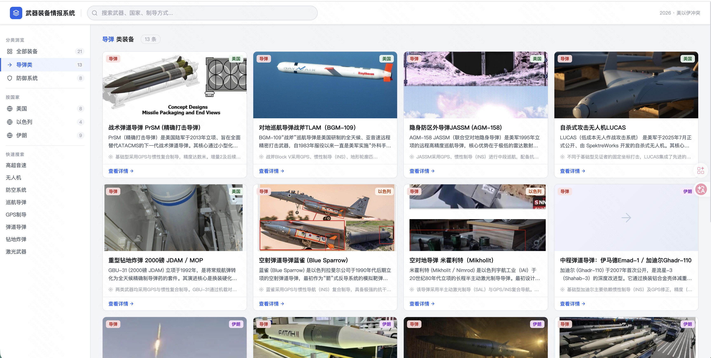

# 武器装备情报查询系统

基于 Vue 3 的纯前端武器装备情报查询系统，涵盖 2026 年美以伊冲突中使用的导弹与防御系统。

**这是一个纯静态项目，没有后端。**

👉 **在线访问：[https://guanlongbin.github.io/weapon-system/](https://guanlongbin.github.io/weapon-system/)**

---

## 系统架构

```
┌──────────────────────────────────────────────────────────────┐
│                     GitHub Pages（纯静态）                     │
├──────────────────────────────────────────────────────────────┤
│  index.html          ← Vue 3 前端，搜索 + 卡片 + 详情面板      │
│  missiles.json       ← 导弹与防御系统数据（21条）              │
│  strategy-models.json ← 矛攻盾 / 盾防矛策略模型数据            │
│  news-cache.json     ← 每日AI新闻（自动更新）                  │
│  static/             ← Vue 3 本地化 JS                        │
│  images/             ← 武器图片                                │
├──────────────────────────────────────────────────────────────┤
│                     GitHub Actions（后台）                     │
├──────────────────────────────────────────────────────────────┤
│  每天 08:00（北京时间）自动触发 fetch_news.py                  │
│                                                                │
│  Tavily搜索（24h内新闻）→ DeepSeek生成摘要 → news-cache.json   │
│  → 自动 commit + push → GitHub Pages 刷新                     │
└──────────────────────────────────────────────────────────────┘
```

### 四大功能模块

| 模块 | 数据来源 | 说明 |
|------|----------|------|
| 导弹武器系统 | `missiles.json`（type=导弹） | 13种导弹，卡片展示+右侧详情面板 |
| 防御系统 | `missiles.json`（type=防御系统） | 8种防御系统，卡片展示+右侧详情面板 |
| 矛攻盾策略模型 | `strategy-models.json`（offensive） | 13条进攻策略，表格展示 |
| 盾防矛策略模型 | `strategy-models.json`（defensive） | 17条防御策略，表格展示 |

### 每日新闻自动更新机制

```
GitHub Actions（每天 08:00 触发）
    ↓
fetch_news.py
    ├── 读取 missiles.json，提取武器名称（去重21个）
    ├── 对每个武器：Tavily API 搜索最近24小时新闻（days=1）
    ├── 对每个武器：DeepSeek API 生成中文摘要（2-3句）
    ├── 按日期累积写入 news-cache.json（保留最近14天）
    └── 自动 commit + push 到仓库
    ↓
GitHub Pages 自动刷新静态文件
    ↓
用户打开详情面板 → 右侧底部显示"最新动态"时间线
    └── 蓝色竖线 + 叶子卡片（日期、摘要、🔗新闻链接）
```

- 搜索限定24小时内，每天内容不重复
- 同一天重复运行会替换当日条目（不会重复追加）
- 数据按日期累积成数组，保留最近14天历史
- 前端读取 `news-cache.json`，无需任何API调用

### 所需 Secrets（GitHub Actions）

在仓库 `Settings → Secrets and variables → Actions` 配置：

| Name | 说明 |
|------|------|
| `DEEPSEEK_API_KEY` | DeepSeek API Key，用于生成新闻摘要 |
| `TAVILY_API_KEY` | Tavily API Key，用于搜索最新新闻 |

---

## 预览



---

## 功能特性

- 模糊搜索（名称、国家、性能、制导方式等）
- 卡片式结果展示
- 点击卡片 → 右侧滑出详情面板（可滚动）
- 详情面板底部：AI 每日最新动态（时间线展示）
- 策略模型表格：矛攻盾 / 盾防矛
- 支持按国家、类型、关键词快速筛选
- 完全静态部署，无需后端
- Vue 3 本地化，无外部 CDN 依赖

---

## 项目结构

```text
weapon-system/
├── index.html                # 主页面（Vue 3 + 搜索 + 详情面板 + 新闻）
├── missiles.json             # 武器数据（21条）
├── strategy-models.json      # 策略模型数据
├── news-cache.json           # 每日AI新闻（自动生成）
├── fetch_news.py             # 新闻抓取脚本（GitHub Actions 调用）
├── static/
│   └── vue.global.prod.js    # Vue 3 本地文件
├── images/                   # 武器图片
├── .github/workflows/
│   └── fetch-news.yml        # GitHub Actions 定时任务
└── README.md
```

---

## 本地直接打开

如果只是自己看：

1. 下载项目
2. 直接双击 `index.html`
3. 浏览器打开即可

这个项目是静态页，所以**很多情况下甚至不需要服务器**。

---

## 最简单的部署方式

### 方式一：GitHub Pages

适合：想免费上线、最省事。

1. 把代码推到 GitHub 仓库
2. 打开仓库 `Settings`
3. 进入 `Pages`
4. `Source` 选择 `Deploy from a branch`
5. 分支选择 `main`，目录选择 `/(root)`
6. 保存后等待 1 分钟
7. 访问：

```text
https://你的用户名.github.io/weapon-system/
```

---

### 方式二：服务器直接上传

适合：你已经有一台服务器。

你只需要把这些文件上传到网站目录：

- `index.html`
- `missiles.json`
- `static/`
- `images/`

只要能被 Nginx 或其他静态文件服务器访问，就能运行。

---

## 空白服务器从 0 开始

假设你的服务器是全新的 Ubuntu，什么都没有。

### 第一步：安装 Nginx

```bash
sudo apt update
sudo apt install -y nginx
```

安装完成后先测试：

```bash
systemctl status nginx
```

如果看到 `active (running)`，说明成功。

---

### 第二步：准备网站目录

```bash
sudo mkdir -p /var/www/weapon-system
sudo chown -R $USER:$USER /var/www/weapon-system
```

---

### 第三步：上传项目文件

把以下内容上传到 `/var/www/weapon-system/`：

- `index.html`
- `missiles.json`
- `static/`
- `images/`

如果你本地有项目，可以这样传：

```bash
scp -r ./index.html ./missiles.json ./static ./images 用户名@服务器IP:/var/www/weapon-system/
```

---

### 第四步：配置 Nginx

创建配置文件：

```bash
sudo nano /etc/nginx/sites-available/weapon-system
```

写入：

```nginx
server {
    listen 80;
    server_name _;

    root /var/www/weapon-system;
    index index.html;

    location / {
        try_files $uri $uri/ /index.html;
    }
}
```

保存后执行：

```bash
sudo ln -s /etc/nginx/sites-available/weapon-system /etc/nginx/sites-enabled/weapon-system
sudo rm -f /etc/nginx/sites-enabled/default
sudo nginx -t
sudo systemctl reload nginx
```

---

### 第五步：浏览器访问

打开：

```text
http://你的服务器IP/
```

就可以访问了。

---

## 如果你有域名

把域名解析到服务器 IP 后，把 Nginx 配置中的：

```nginx
server_name _;
```

改成：

```nginx
server_name 你的域名;
```

然后重载：

```bash
sudo nginx -t
sudo systemctl reload nginx
```

---

## 如果要加 HTTPS

安装 certbot：

```bash
sudo apt install -y certbot python3-certbot-nginx
```

执行：

```bash
sudo certbot --nginx -d 你的域名
```

按提示完成即可。

---

## 更新方式

以后每次更新，只需要重新上传这几个静态文件：

- `index.html`
- `missiles.json`
- `static/`
- `images/`

如果只是改了页面，通常只传 `index.html` 就够了。

---

## 说明

这个项目本质上就是一个静态网站，所以部署原则很简单：

- 不需要 Python
- 不需要 Flask
- 不需要数据库
- 不需要安装 Node.js
- 只需要一个能提供静态文件访问的环境

最简单的两种方式就是：

1. GitHub Pages
2. Nginx 静态托管
